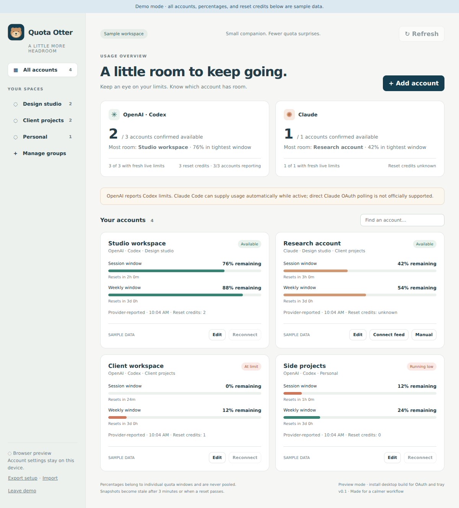

# 🦦 Quota Otter

**A little more headroom.** A Tauri 2 desktop companion for tracking AI accounts by project or company, with a menu-bar/system-tray summary. MIT licensed.

This is an early source release in `panbanda/quota-otter`, not yet a published installer. Homebrew tap: `panbanda/homebrew-brews`.



## What works in this implementation

- Add, rename, remove, and search accounts. Create/rename/remove groups; an account may belong to multiple groups.
- Per-vendor group summaries, available-account counts, individual quota windows, reset countdowns, and the account with the most remaining headroom.
- OpenAI subscription OAuth through the official native Codex app server, with a separate `CODEX_HOME` for each local account. Tokens stay in Codex's OS credential store. No existing CLI login is imported.
- Codex primary/secondary and multi-bucket limits; available earned reset credits when supplied by the service. Missing values remain unknown.
- Claude Code automatic status-line feed, with separate per-card output files. Manual snapshots remain available as a fallback.
- Native tray menu on macOS, Windows, and Linux; macOS also gets compact menu-bar text. Closing the window hides it; Quit in the tray exits.
- Local settings and quota snapshots; export/import of account labels and group memberships, excluding credentials and usage history. Imports merge without removing existing sign-ins.
- A clearly labeled, isolated demo workspace.

## Provider support and its limits

| Source | Authentication | Usage coverage | Independent background polling |
| --- | --- | --- | --- |
| OpenAI / Codex | Official app-server browser sign-in | Codex rate-limit windows and available reset-credit count when exposed | Yes, while Quota Otter runs and is online |
| Claude Code feed | Claude Code owns its own login | Status-line `five_hour`, `seven_day`, and optional gateway `spend_limit` | No; observations arrive while Claude Code is active |
| Manual Claude snapshot | None | Values you enter | No |

**This does not completely meet the original goal of independent OAuth polling for both vendors.** Claude's independent third-party OAuth integration remains unresolved. OpenAI's data is Codex-specific; it is not an exact count of all messages or quotas in every ChatGPT feature. Quota percentages cannot reliably be converted into an exact number of prompts.

Jcode demonstrates a technically possible alternative: its [usage implementation](https://github.com/1jehuang/jcode/blob/master/crates/jcode-base/src/usage.rs) reads an Anthropic OAuth usage endpoint with a bearer token and Claude Code attribution headers. Its [OAuth implementation](https://github.com/1jehuang/jcode/blob/master/crates/jcode-base/src/auth/oauth.rs) implements a Claude Code client flow. That is not evidence of a supported third-party OAuth agreement. Anthropic's [published authentication guidance](https://code.claude.com/docs/en/legal-and-compliance) restricts third-party Claude.ai sign-in and credential intermediation. Quota Otter uses the documented status-line integration instead; it does not reproduce those private authentication calls or impersonate Claude Code.

## Run locally

Install Node.js 22+ (CI uses 24), Rust stable, and your platform's [Tauri prerequisites](https://v2.tauri.app/start/prerequisites/). Then:

```sh
npm ci
npm test
npm run desktop
```

For a frontend-only preview with no desktop dependencies:

```sh
npm run dev
```

Open `http://127.0.0.1:1420`. Browser preview supports setup and manual snapshots. OAuth, tray, and Claude feeds require the desktop app.

Build a local installer with `npm run desktop:build`. The release workflow builds macOS universal (Intel + Apple Silicon), Windows x86-64 MSI/NSIS, and Linux x86-64 DEB/AppImage. Runtime coverage across these operating systems is not yet certified. macOS deployment minimum is 12.0; initial bundles are unsigned and not notarized.

## Connect OpenAI accounts

1. Install the **official native Codex binary** on your desktop application's PATH. On Windows, this must resolve to `codex.exe`, not just an npm `.cmd` shim. On macOS, GUI applications may have a different PATH from your terminal; see the note below.
2. Add an OpenAI account card and select Sign in.
3. Finish the official browser sign-in, choosing the intended account. Return and click “I've signed in.” Check the displayed email.
4. Repeat for each distinct account. The browser is needed for sign-in only; subsequent usage reads use the isolated Codex session. Do not add duplicate cards for the same underlying subscription: reset credits belong to the subscription, not the local card.

The app requires the OS credential store (Keychain, Windows credential store, or Linux Secret Service). It requests `cli_auth_credentials_store="keyring"` and does not intentionally fall back to plaintext tokens. Corporate Codex requirements may impose different settings; those policies remain effective. Signing out/removing an OpenAI card invokes the official logout operation before clearing its profile. If logout fails, the card is retained so you can retry.

The app checks the inherited PATH and common Homebrew/native installation locations for Codex. Install the official binary normally; do not place an untrusted executable named `codex` on your PATH. The app never runs a model turn to discover quota.

## Connect Claude feeds

1. Install Node.js and Claude Code **v2.1.251 or newer**. Anthropic documents rate-limit status-line data for Pro/Max and supported gateway spend limits; other plans may not provide these fields.
2. Add a Claude card and choose **Connect feed**. The app generates a small helper and a session-specific settings file.
3. Run the displayed `claude --settings ...` command in your project terminal. Verify the correct account inside Claude Code before working.
4. After Claude Code receives an API response, it passes documented quota fields to the helper. Quota Otter reads the resulting snapshot on its next refresh.

Each card has its own feed file, but a feed is **user-assigned**: the status-line payload does not verify the subscription identity. Keep your actual Claude profiles/accounts separated in Claude Code and map each one to the matching card. This app does not independently manage multiple Claude logins. It does not modify your default Claude settings, but the displayed launch command selects this status line for that session. If you already have a custom status line, integrate the helper into it yourself instead.

The helper writes only quota fields, an observation timestamp, and an opaque freshness hash. It does not save tokens, prompts, transcript paths, or raw session IDs. It does not contact Anthropic. Repeated status-line renders with unchanged usage/API timing preserve the original observation time. A fresh API timing observation can still reflect cached service data; there is no claim of an independent quota fetch.

Close sessions using a feed before removing its card. Otherwise an active status-line process can recreate its output file. Claude reset-credit counts are unavailable through this documented feed and stay unknown.

## Reading the dashboard

- A summary reports the number of accounts with fresh, positive readings; it does not sum different plan percentages. The “most room” account is chosen conservatively by the tightest reported window, including model-specific buckets. This is not a model-aware routing recommendation.
- Data older than three minutes, a failed refresh, or any passed reset becomes stale. The UI never assumes that a reset refilled the quota. Manual readings are always marked manual and excluded from confirmed availability.
- Reset-credit totals include only fresh OpenAI accounts reporting a count; coverage is shown. Do not duplicate one subscription across multiple cards.
- The tray follows the selected group. Search only filters the cards. Native polling requests refresh every minute; sleeping machines cannot refresh. A native watchdog replaces the tray summary with “stale” if the webview stops updating it.
- Linux desktop shells must support tray/AppIndicator icons; some GNOME installations need a tray extension. Linux does not provide all of macOS's text/tooltip features, so the menu carries the summary.

## Publish on GitHub and Homebrew

See [PUBLISHING.md](PUBLISHING.md). The app release workflow and proposed tap updater are included. A cask becomes installable only after the first complete GitHub release and the corresponding tap change.

## Validation

See [VALIDATION.md](VALIDATION.md) for the checks actually run and remaining native/live-account validation. Tests use synthetic data and do not sign in to your accounts.

## Architecture and next steps

The frontend is dependency-free JavaScript/CSS. Tauri exposes a small fixed command surface; provider URLs and subprocess methods are selected in Rust. Codex subprocess connections are serialized per account, isolated between accounts, and terminated on application exit. The frontend receives usage and a display email, not OAuth tokens. The Claude helper is embedded in the executable at build time.

Remaining work includes an approved independent Anthropic integration, live account verification across all platforms, automatic account switching/routing, safe reset redemption, notifications, signed/notarized releases, and optional encrypted cross-machine synchronization. Version 0.1 uses export/import for moving setup between machines; each machine signs in separately.

Official references: [Codex app server](https://learn.chatgpt.com/docs/app-server), [Codex credential storage](https://learn.chatgpt.com/docs/config-file/config-reference), [Claude status line](https://code.claude.com/docs/en/statusline), [Tauri tray](https://v2.tauri.app/learn/system-tray/).
